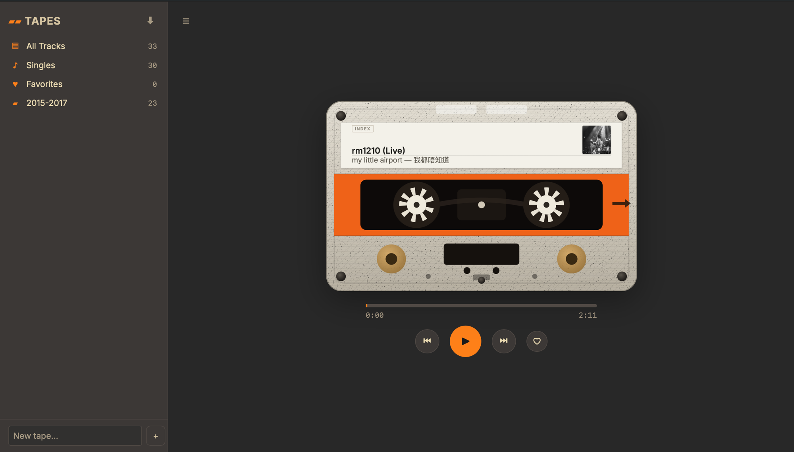

# Tapes

A personal cassette-deck music streamer for the home stack. The home page is a
cassette deck — the reels spin while a track plays and the paper label re-skins
to the current song.



## Features

- **Cassette-deck player** — animated reels, scrubber, shuffle / repeat,
  favorites, keyboard shortcuts (`Space`, `Shift + ←/→`), lock-screen controls,
  and it resumes your queue across sessions and devices.
- **Browse** — All Tracks (sortable: by artist / recently added / recently
  played / most played), Singles, Favorites, Albums, Artists, and your own tapes.
- **Up Next** queue with drag-to-reorder; *Play next* / *Add to queue* per track.
- **Rip** any URL to MP3 with cover art via `yt-dlp` + `ffmpeg`, with live
  progress over SSE; paste a YouTube playlist to rip it into a new tape. The
  original source URL is saved with each track.
- **Tidy metadata** — ripped tags are cleaned automatically (YouTube cruft
  stripped, `Artist - Title` split). With `ANTHROPIC_API_KEY` set, a Claude
  (Haiku) pass then refines title/artist and fills in a blank album when it's
  confident — using the source URL, channel/uploader, and yt-dlp's own parsed
  fields as signals; without a key it falls back to the deterministic cleanup.
- **Cover art** — on rip, the weak YouTube thumbnail is replaced with real album
  art from **MusicBrainz** + the Cover Art Archive when a confident
  artist/album match exists (no API key). `flask art` backfills the library.
  `flask retag` re-cleans an existing library (`--llm` to use Claude in bulk).

## Run it — standalone

```sh
uv sync
export MUSIC_DIR=/path/to/mp3s            # optional; defaults to ./music
uv run flask --app app:create_app scan    # index the library
uv run flask --app app:create_app run --port 5003
# open http://127.0.0.1:5003
```

`ffmpeg` must be on your `PATH` for ripping. Set `ANTHROPIC_API_KEY` to enable
the LLM tag pass (optional — rips work without it via deterministic cleanup);
`LLM_CLEANING=0` disables it even when a key is present. There's no login in standalone mode
— a single local user is attached automatically. To try it without your own
music, `uv run python scripts/generate_samples.py` writes tagged demo tracks
into `./music`.

## Run it — home stack

Served at `/music/` behind the [dashboard](../dashboard) nginx proxy: gated by
its `auth_request` and streaming audio via `X-Accel-Redirect`. The service is
wired into `../dashboard/docker-compose.yml` (internal port `5003`).

```sh
cd ../dashboard
MUSIC_HOST_DIR=/mnt/backup/music docker compose up -d --build music
```

Dashboard handles login; tapes trusts the `X-Forwarded-User` header and keeps
its own `users` rows for favorites, tapes, and playback state.

After adding a user in dashboard, sync shadow accounts:

```sh
cd ../dashboard && uv run python scripts/sync_household_users.py
```

> Code is baked into the image at build time. After pulling changes, rebuild:
> `docker compose build music && docker compose up -d music`. A bare `up -d`
> reuses the old image.

## Commands

```sh
uv run flask --app app:create_app scan [--full] [--prune]   # index MUSIC_DIR
uv run flask --app app:create_app retag [--write] [--llm] [--pending]  # clean (and enrich) tags
uv run flask --app app:create_app art [--write] [--all]     # fetch cover art (MusicBrainz)
```

`scan` is incremental (mtime/size cache); `--full` re-reads every file, `--prune`
drops rows for deleted files. `art` looks up cover art on MusicBrainz for tracks
with a known artist + album (preview by default; `--write` embeds it, `--all`
also upgrades tracks that already have a thumbnail) — throttled to ~1 lookup/sec
per MusicBrainz policy. `retag` previews by default; `--write` applies the
cleanup in place and rescans. `--llm` routes the (already deterministically
cleaned) tags through Claude via the **Message Batches API** to correct
title/artist and fill in a blank album — needs `ANTHROPIC_API_KEY`, costs ~half
the standard rate, and takes up to ~an hour for a large library. Enrichment only
fills an empty album; it never overwrites existing tags. If the LLM pass is
skipped on a rip (no key / API error) the track is flagged `needs_llm`;
`retag --llm --pending` sweeps up just those misses in one batch and clears the
flag — handy to schedule, or to run after topping up credit.

## Layout

```
app.py          create_app: db, login, blueprints, static cache-busting
cleaning.py     deterministic title/artist cleanup for rips
llm_cleaning.py Claude (Haiku) tag correction + album fill; sync per-rip, Batches for retag
scan.py         flask scan / flask retag — mutagen tags + Pillow thumbnails
downloader.py   yt-dlp worker, playlist expansion, tag cleanup
routes/         index · stream · library (shelves/tapes/albums/artists) · downloads · auth
static/         css (tokens · primitives · index · player) + player.js
templates/      index.html
```
